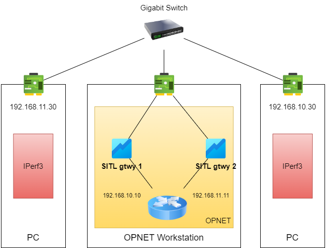

# OPNET SITL Benchmark

[中文版本](./README.md)

## Introduction

> System-in-the-Loop (SITL) provides an interface between a simulated network running in Modeler and a physical network. Packets traveling between the simulated and real networks are translated between real and simulation formats. With SITL, physical hardware and a simulation can interact as a unified system. SITL is optional functionality.
>
> A SITL simulation can be used for various purposes, such as:
>
>* Developmental, scalability, and stress testing
>* Interoperability testing
>* Training system development
>* Model validation 

## Motivation
We conduct this benchmark for testing performance of OPNET SITL interface, in order to provide a reference for system desgin with SITL interface. No similar benchmark result are found through the Internet, so we conduct this benchmark test and publish our results. This will be updated with new results coming out. 

The purpose of this Benchmark is to test the performance of the SITL interface itself, so a simple topology is used to reflect the real SITL performance.

## Benchmark Environment
### Hardware Environment：
- Intel(R) Core(TM) i7-8700 CPU @ 3.20GHz
- 32GB DDR4 2400MHz
- Intel(R) Ethernet Connection I219-V (Gigabit NIC)
- Gigabit LAN

### Software Environment：
- Operating System: Microsoft Windows 10 build 10.0.19044.1766
- OPNET Environment: Riverbed Modeler 18.6.1 Build 20050 64bit
- Compiler: Microsoft Visual Studio 2010 (build 16.00.30319.01)
- libpcap: Npcap version 1.55
- Network benchmark tool: iperf 3.1.3

**Note:** 
OPNET 18.6.1 SITL uses Winpcap as the packet capture and sending tool by default. While we found Npcap is based on Winpcap and is more powerful than Winpcap, it also supports Winpcap compatibility mode. And according to our previous experience, it is more stable and has less bugs (if the simulation crashes with Winpcap, it is likely to restart the operating system to be able to re-simulate). Therefore, this test was conducted using Npcap.

## Benchmark Scenario
This simulation test scenario was performed using one router and two SITL interfaces. The two physical machines are connected to the simulation workstation through a gigabit switch, each in a different subnet. The simulated network acts as the intermediate router. This is shown in the figure below.

The actual OPNET test scenario is configured as follows.

## Benchmark Result
The bandwidth results using iperf3 are as follows.

Bandwidth result in default configuration: **79.5Mbits/sec** .

We change the configuration for better performance:
1. [IP]-[IP Processing Information]-[Datagram Forwarding Rate]: **50,000 packets/second** => **Infinity**
2. [IP]-[IP Processing Information]-[Datagram Switching Rate(packets/sec)]: **500,000 packets/second** => **5,000,000,000 packets/second**

The result in new configuration: **94.4Mbits/sec**.

## Conclusion
In the above simulation scenario, the SITL bandwidth is shown below.

|  Simulation Scenario   | Bandwidth Benchmark Result |
|  ----  | ----  |
| Default Router Configuration  | 79.5Mbits/sec |
| Better Router Configuration  | 94.4Mbits/sec |
