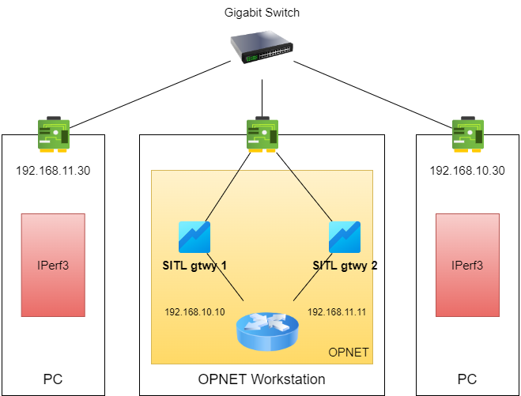
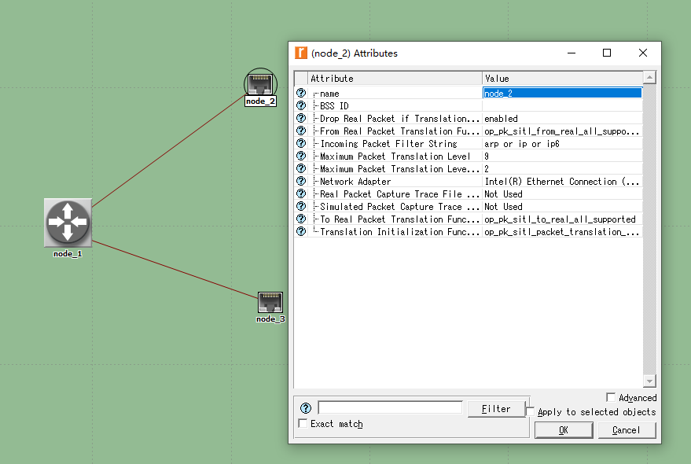
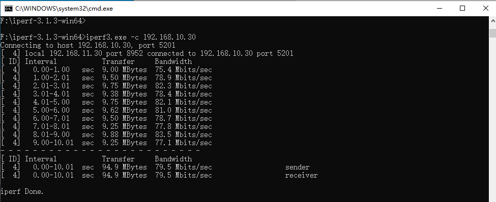
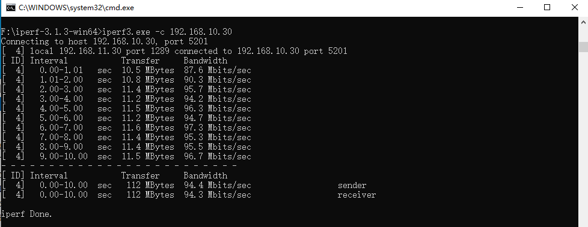

# OPNET SITL benchmark

[English Version](./README-EN.md)

## 介绍
> SITL(System in the Loop) 提供了一个在OPNET Modeler的虚拟网络和真实物理网络之间的接口。虚拟网络和真实网络交互的数据包在两种格式之间进行翻译。使用SITL几口，物理网络能够和仿真网络在同一的系统中进行交互。SITL是可选功能。
> SITL仿真可以用于多种用途，例如：
> * 开发测试、扩展性测试和压力测试
> * 互操作性测试
> * 训练系统开发
> * 模型验证

## 测试动机和目的
进行本次Benchmark主要是为了测试SITL接口的性能表现，以便为后续采用SITL接口进行开发的系统提供设计参考。但是目前在网络上没有找到类似的测试结果，因此我们进行了这项测试并将结果公布。后续新的测试结果也会继续更新本结果。

本次Benchmark的目的是测试SITL接口本身的性能，因此尽量采用更加简单的测试拓扑，力图反映真实的SITL性能表现。

## 测试环境
### 硬件环境：
- Intel(R) Core(TM) i7-8700 CPU @ 3.20GHz
- 32GB DDR4 2400MHz
- Intel(R) Ethernet Connection I219-V (Gigabit NIC)
- 纯千兆局域网环境

### 软件环境
- 操作系统：Microsoft Windows 10 build 10.0.19044.1766
- OPNET环境：Riverbed Modeler 18.6.1 Build 20050 64bit
- 编译器：Microsoft Visual Studio 2010 (build 16.00.30319.01)
- libpcap: Npcap version 1.55
- 网络测试工具：iperf 3.1.3

**注意:** OPNET 18.6.1 的SITL默认使用Winpcap作为数据包的抓取和发送工具。Npcap基于Winpcap开发且比winpcap更为强大，也支持Winpcap的兼容模式。且根据之前的使用经验，其更稳定也不易出现问题（Winpcap如果仿真出现崩溃情况，大概率需要重启操作系统才能重新仿真）。因此本次测试使用Npcap进行。

## 测试场景
本次仿真测试场景使用一个路由器和两个SITL接口进行。两台物理机通过局域网千兆交换机连接到仿真工作站，分别处于不同的网段。仿真工作站仿真的虚拟网络充当中间的路由器。如下图所示。

OPNET实际测试场景搭建如下：

## 测试结果
使用iperf3的测试带宽结果如下。

路由器默认配置下：测试带宽结果为 **79.5Mbits/sec**

调整路由器的性能配置:
1. [IP]-[IP Processing Information]-[Datagram Forwarding Rate]: **50,000 packets/second** => **Infinity**
2. [IP]-[IP Processing Information]-[Datagram Switching Rate(packets/sec)]: **500,000 packets/second** => **5,000,000,000 packets/second**

调整后的测试结果为：**94.4Mbits/sec**

## 结论
在上述测试场景下，测出的带宽为：
|  测试场景   | 带宽结果  |
|  ----  | ----  |
| 默认路由器配置  | 79.5Mbits/sec |
| 提高路由器转发能力  | 94.4Mbits/sec |
